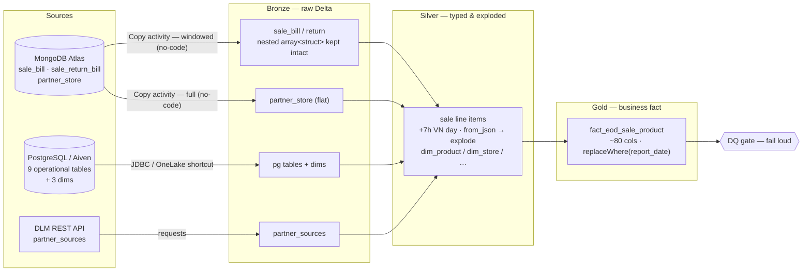

# ssv-data-platform

Production-style **medallion lakehouse** on Microsoft Fabric that migrates a legacy
pandas + Airflow end-of-day (EOD) sales ETL to a Fabric-native OneLake Delta pipeline —
ingesting from **MongoDB, PostgreSQL and a REST API**, transforming through
**bronze → silver → gold**, and guarding output with a **data-quality gate**.


The pipeline is deployed and verified end-to-end in Fabric against real sources
(MongoDB Atlas, Aiven PostgreSQL, a Cloudflare-Workers mock for the DLM API), and the
whole transform layer is unit- and integration-tested on a local SparkSession — no
Fabric needed to run the tests.

---

## What this demonstrates

- **Multi-source ingestion** with the right tool chosen per source (no-code Copy for Mongo, JDBC for Postgres, REST for the API).
- **Medallion architecture** (raw → typed/exploded → business fact) on Delta with **idempotent** partition writes.
- **Testability**: functional-core transforms are pure `df -> df`, covered by unit + e2e tests on local Spark.
- **Data quality as a gate**: a fail-loud check turns the pipeline red on bad data instead of publishing it.
- **Config over code**: a swappable secret resolver + per-source toggles → the same code runs local, dev and prod.
- **Realistic data**: a deterministic simulator mirrors the real source topology and generates a configurable date range for trend/MoM dashboards.

---

## Architecture



**Bronze** lands each source as raw Delta, one entrypoint per source. **Silver** shifts
`documentDate` by **+7h** to VN business day, parses the nested Mongo `saleNormalItems`
array (`from_json` → `explode`) into line items, and builds the conformed dims. **Gold**
joins promotions, delivery, price timeline and dims into an ~80-column fact at
**sale-line grain**, then writes with `replaceWhere(report_date)` so a re-run of any day
is idempotent and history accumulates one partition per day.

---

## Ingestion: choose the tool by data shape

The pipeline mixes **no-code (Copy) and code** ingestion, chosen per source — a concrete
demonstration that the right tool depends on the *shape* of the data:

| Source | Collection / tables | Tool | Note |
|---|---|---|---|
| MongoDB | `sale_bill`, `sale_return_bill` | **Copy activity** (no-code) | nested `array<struct>` → mapped as a **single JSON String** column |
| MongoDB | `partner_store` | **Copy activity** (no-code) | flat document, full load |
| PostgreSQL | 9 operational + 3 dims | **JDBC** (dev) / **OneLake shortcut** (prod) | relational, bulk |
| DLM | `partner_sources` | **`requests`** (code) | small REST payload |

> **Lesson learned — Copy flattens nested arrays unless you map them as one String.**
> By default the Copy mapping expands `saleNormalItems` into per-field columns
> (`saleNormalItems.productCode`, …) and writes **NULL** into the destination array —
> proven: `bronze.sale_bill` had rows but `count(saleNormalItems)=0`, so every `product_id`
> in gold came out null. The fix is to **collapse `saleNormalItems` / `transactionPromotions`
> to a single `String` column in the mapping** (and *not* re-run "Import schema", which
> re-expands them); Copy then serialises the whole array to a JSON string, which silver
> parses with `from_json` → `explode`. Takeaway: no-code *can* handle nested Mongo
> documents — you just have to understand how the connector maps arrays. (`bronze.py` also
> ships an equivalent Spark-connector path, `ingest_mongo`, if you prefer code.)

---

## Data-quality gate

`dq_check.py` (notebook `nb_dq_check` in the pipeline) validates the gold fact **for the run day** and raises
on any violation, so the pipeline activity goes red instead of silently publishing:
row count > 0, no null `transaction_id` / `product_id` / `report_date`, and
`final_amount` present for completed rows.

> **Lesson learned — scope DQ to the partition, not the whole table.** The first version
> asserted "gold has a *single* `report_date` == run day". That held when gold stored one
> day, but broke the moment gold began **accumulating history** via `replaceWhere`
> (`distinct=2` → failure). The fix: filter gold to `report_date == running_date` first,
> then check that slice. Validating the run-day partition is the correct scope for an
> incremental load.

---

## Design

**Functional core + thin OOP shell.** All transforms are pure functions (`df -> df`) that
run anywhere; the only objects are `PipelineContext` (spark + run window + secret resolver
+ logger) and `MedallionPipeline` (a Template-Method base owning run order, logging,
`backfill`, and idempotent writes). No object holds DataFrame state → everything is unit-testable.

**Idempotency.** `write_delta(..., replaceWhere=report_date)` replaces only the run's
partition, so any day can be safely re-run and a backfill just loops days.

**Config over code.** A single secret resolver is injected; swapping local Spark conf for
Azure Key Vault is a one-line change. Per-source toggles (`_opt(ctx, "pg-jdbc")`, etc.)
let the same `bronze_ingest` skip sources that arrive by shortcut in prod but by JDBC in dev.

---

## Repo layout

```
ssv_data/                     # SHARED library -> built as a wheel, attached to a Fabric Environment
  config.py                   # bronze/silver/gold names, VN tz offset (+7h)
  runtime/  context.py window.py pipeline.py logging.py   # PipelineContext + MedallionPipeline (Template Method)
  io/       readers.py writers.py                         # windowed/semi-join JDBC readers; write_delta(replaceWhere)
  schema/   registry.py cast.py                           # StructTypes; fill-missing + cast-by-schema
  transforms/ common.py scd.py # pure df->df: pivot/range-join/coalesce + SCD2 (scd2_apply, as_of_join)

sample_file/                  # PER-PIPELINE code — local copies of the Fabric notebooks (%run chain)
  bronze.py.ipynb             # per-source ingest: Mongo (windowed) / PG (windowed+semi-join/full) / DLM
  silver.py.ipynb gold.py.ipynb  # +7h day, explode items, SCD2 dims; ~80-col fact, as-of joins
  pipeline.py.ipynb dq_check.py.ipynb nb_bi_refresh.py.ipynb simulators.py.ipynb ...
  Pipeline_eod_sale_product/  # Fabric Data Pipeline definition (activities incl. nb_bi_refresh)
  create_report_pbir.py       # PBIR report generator (API-built dashboard pages)

fabric_items/                 # EXPORTED workspace definitions (13 notebooks, 2 pipelines,
                              #   TMDL model, PBIR report) + manifest.json — backup & DR source
tools/                        # fabric_api.py (SPN/az auth + LRO) · deploy_wheel.py ·
                              #   export_definitions.py · deploy_definitions.py (restore/DR)
                              #   · verify_run.py + baseline_sales_daily.json
sample_service/               # DLM mock (FastAPI + Cloudflare Worker + Dockerfile)
tests/                        # 24 unit + e2e tests on a local SparkSession (no Fabric)
docs/architecture/            # eod-sales-flow.drawio (4 pages) + rendered PNG previews
docs/superpowers/specs/       # design specs (windowed extraction, SCD2, dashboard extension)
.github/workflows/            # ci.yml (pytest+build) · deploy.yml (wheel -> Fabric via SPN)
```

Architecture diagrams: [docs/architecture/eod-sales-flow.drawio](docs/architecture/eod-sales-flow.drawio)
(4 pages: simple overview, Fabric platform map, medallion data flow, orchestration + CI/CD) —
PNG previews render inline: [overview](docs/architecture/eod-sales-flow-overview.png) ·
[platform](docs/architecture/eod-sales-flow-platform.png) · [data flow](docs/architecture/eod-sales-flow-data.png) ·
[orchestration](docs/architecture/eod-sales-flow-orchestration.png).

---

## The `eod_sale` pipeline

- **Grain:** one row per sale line item.
- **Time:** source `documentDate` is UTC; a VN business day is `documentDate + 7h`. The run
  window derives `[utc_lo, utc_hi)` and Mongo reads are pushed-down on that window.
- **Customer id:** coalesce priority **flips on 2022-04-01** (handled explicitly in gold).
- **Cancellations:** delivery status 5/13 + `delivery_status='canceled'` are kept as canceled rows.
- **Cost/price:** `range_join_effective` joins the purchase-price timeline valid at transaction time.

---

## Run it locally

```bash
pip install -e ".[test]"     # pyspark + pytest + chispa
pytest -q                    # unit transforms + full e2e on local Spark
```

Seed synthetic data and run the pipeline with `with_ingest=False` (pure POC, no external sources):

```python
%run simulators.py
save_all_bronze(spark)                                   # one day -> bronze Delta
EodSalePipeline(spark=spark, schema_enabled=True).run("2025-11-17", with_ingest=False)

# multi-day for trend/MoM dashboards:
save_all_bronze(spark, start="2025-11-01", end="2025-11-30")
for d in _daterange("2025-11-01", "2025-11-30"):
    EodSalePipeline(spark=spark, schema_enabled=True).run(d, with_ingest=False)
```

The simulator keeps master data (products, stores, users) stable across days and generates
transactions **per day** with a date-derived seed and a weekday/weekend volume pattern, so
ids are globally unique across days and dashboards show real day-over-day trend.

---

## Deploy on Fabric

1. **Build & attach the wheel.** `python -m build --wheel` → upload to a **Custom Environment**
   (Libraries), publish, attach to the notebooks.
2. **Secrets** as Environment Spark conf (`spark.ssv.secret.mongo_conn`, `pg_jdbc`, `dlm_auth`,
   `dlm_url`); the resolver maps `-`→`_`. In production, swap the resolver for Key Vault
   (`notebookutils.credentials.getSecret`) — one line.
3. **Jars** in the Environment: `org.postgresql:postgresql:42.7.4` (for the PG JDBC ingest).
   Add `org.mongodb.spark:mongo-spark-connector_2.12:10.4.0` only if you use the optional
   code path (`ingest_mongo_bills`) instead of the Copy activities.
4. **Data pipeline** (`Pipeline_eod_sale_product`): `Set variable (v_run_date)` →
   `[cp_mongo_sale_bill ‖ cp_mongo_return ‖ cp_mongo_partner_store ‖ nb_ingest_pg ‖ nb_ingest_dlm]`
   → `nb_transform` → `nb_dq_check` → `nb_bi_refresh` (rebuilds the `bi_*` marts +
   `dim_date` the semantic model reads, so dashboards only refresh from data that
   passed the DQ gate). `run_date` empty → yesterday (VN); else an explicit
   date for backfill.
5. **Backfill** a range with a **ForEach (Sequential)** parent pipeline that invokes the
   pipeline once per day — sequential because bronze is overwritten per run while only gold
   is partition-safe.
6. **Schedule** daily ≥ 17:00 UTC; alert on failure.

### Environments

| | Bronze source | Secrets | Notes |
|---|---|---|---|
| **Local / test** | synthetic → bronze, or JDBC | local Spark conf | `pytest`, no Fabric |
| **Dev** | Atlas + Aiven PG + mock DLM | Spark conf | full multi-source extract |
| **Prod** | OneLake shortcut / Mirroring + connectors | **Azure Key Vault** | wheel from CI |

---

## Note on data

All source data here is **synthetic** (`simulators.py`) but structurally faithful to the
real system: nested Mongo documents, the relational + dim tables, the DLM payload, the
+7h day boundary and the customer-id rule. Swapping in a real source is a config change
(secret + toggle), not a code change.
## CI/CD & tooling

- **CI** (`.github/workflows/ci.yml`): pytest + wheel build on every PR/push.
- **CD** (`.github/workflows/deploy.yml`): manual button or `v*` tag → test → build →
  publish wheel to the Fabric `Custom_Env` (SPN secrets: `FABRIC_TENANT_ID/CLIENT_ID/CLIENT_SECRET`).
  Notebooks / semantic model / report are developed directly on Fabric (thin-shell rule:
  logic goes into `ssv_data` with tests, notebooks only wire and call).
- **`tools/`**: `deploy_wheel.py` (staging→publish), `export_definitions.py` (backup all
  workspace item definitions into `fabric_items/`), `verify_run.py` (idempotent pipeline
  run + DAX diff vs `tools/baseline_sales_daily.json` — synthetic data is deterministic,
  any drift = regression). Auth: SPN env vars, falling back to `az` CLI login.
- **`fabric_items/`**: exported definitions (notebooks/pipelines/TMDL/PBIR) + `manifest.json`
  (item ids for reference remapping) — the workspace's state in reviewable text form;
  re-export via `tools/export_definitions.py`.
- **Restore / disaster recovery**: `tools/deploy_definitions.py` pushes `fabric_items/` back —
  in-place updates on the same workspace, or full rebuild into a NEW workspace
  (`--workspace <id>`) with automatic GUID remapping (lakehouse/notebook/model refs);
  then `tools/deploy_wheel.py` + seed/backfill for data.
